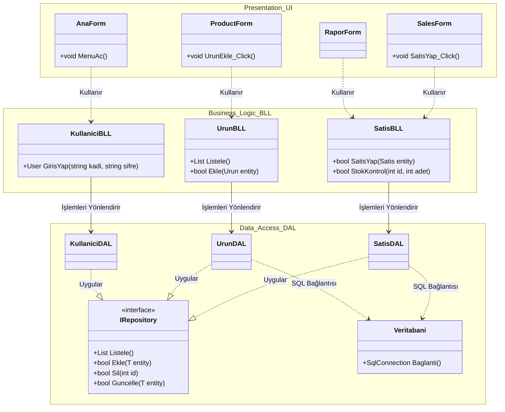

# 📦 Stok Takip Otomasyonu (Stock Tracking Automation)

C# ve Windows Forms kullanılarak geliştirilmiş, N-Katmanlı Mimari (N-Tier Architecture) yapısına uygun bir stok takip uygulamasıdır. Bu proje ile ürün yönetimi, kategori işlemleri, müşteri takibi ve satış işlemleri kolayca yapılabilir.


## 🚀 Proje Özellikleri

Proje, farklı yetki seviyelerine sahip kullanıcıların (Admin, Satış Personeli, Depocu) kendi işlerini yürütebileceği kapsamlı bir otomasyon sistemidir.

### 🔐 1. Gelişmiş Giriş Sistemi (Login)
Sisteme 3 farklı yetki seviyesi ile giriş yapılabilir. Her kullanıcının yetkisine göre menüler şekillenir:
* **Admin:** Tam yetkili yönetici.
* **Satış Elemanı:** Sadece satış odaklı işlemler.
* **Depocu:** Stok ve ürün takibi işlemleri.

### 📦 2. Ürün Yönetimi
* Yeni ürün ekleme, mevcut ürünü güncelleme ve silme işlemleri.
* Ürünlerin stok adetlerinin ve detaylarının yönetilmesi.

### 👥 3. Müşteri Yönetimi (CRM)
* Müşteri ekleme, silme ve bilgilerini güncelleme.
* **Müşteri Türü Seçimi:** Müşterileri **"Perakende"** veya **"Toptan"** olarak sınıflandırma imkanı.

### 💰 4. Satış İşlemleri
* Kolay satış arayüzü: Müşteri seç -> Ürün seç -> Adet gir -> Satışı Tamamla.
* Satış yapıldığında stoktan otomatik düşüş sağlanması.

### 📊 5. Detaylı Raporlama ve Analiz
İşletmenin durumunu analiz etmek için görsel ve sayısal veriler sunar:
* **📉 Kritik Stoklar:** Biten veya azalmakta olan ürünlerin listesi.
* **🏆 En İyi Müşteriler:** En çok alışveriş yapan müşterilerin analizi.
* **🔥 En Çok Satanlar:** En popüler ürünlerin listelenmesi.
* **💵 Finansal Durum:** Toplam Ciro, Kar/Zarar durumu ve Aylık Satış grafikleri.
## 🏗️ Mimari ve Teknolojiler


Proje, sürdürülebilirlik ve temiz kod prensipleri gereği **Katmanlı Mimari (N-Tier Architecture)** kullanılarak geliştirilmiştir.

- **Dil:** C#
- **Platform:** .NET Framework (Windows Forms)
- **Veritabanı:** MS SQL Server
- **Mimari:**
  - **DAL (Data Access Layer):** Veritabanı bağlantıları ve CRUD işlemleri.
  - **BLL (Business Logic Layer):** İş mantığı, validasyonlar ve kurallar.
  - **UI (User Interface):** Kullanıcı arayüzü formları.
  - **DTO (Data Transfer Object):** Katmanlar arası veri taşıma modelleri.


## 📷 Ekran Görüntüleri

<details>
<summary>Ekran Görüntülerini Görmek İçin Tıklayın</summary>

| Giriş Ekranı | Ana Menü |
| :---: | :---: |
|  |  |

| Ürün Yönetimi | Müşteri Yönetimi |
| :---: | :---: |
|  |  |

| Satış Ekranı | Raporlar |
| :---: | :---: |
|  |  |

</details>

## 📐 Proje Mimarisi ve Diyagramlar

<details>
<summary>Diyagramları ve Mimarisi Görüntülemek İçin Tıklayın 🔽</summary>

### 🗄️ Veritabanı İlişki Şeması (E-R Diyagramı)
Bu şema, projedeki gerçek veritabanı tablolarının birebir yapısını gösterir:

```mermaid
erDiagram
    USERS ||--o{ SATISLAR : "Satis Yapar"
    MUSTERILER ||--o{ SATISLAR : "Satin Alir"
    SATISLAR ||--o{ SATIS_DETAY : "Icerir"
    URUNLER ||--o{ SATIS_DETAY : "Listelenir"

    USERS {
        int id PK
        string username
        string password
        string role "Yonetici/Personel"
    }

    MUSTERILER {
        int id PK
        string ad
        string soyad
        string musteri_turu "Perakende/Toptan"
        string telefon
        string eposta
    }

    URUNLER {
        int id PK
        string urun_adi
        int stok_miktari
        decimal alis_fiyati
        decimal satis_fiyati
        int min_stok_seviyesi
    }

    SATISLAR {
        int id PK
        int musteri_id FK
        int kullanici_id FK
        datetime satis_tarihi
        decimal toplam_tutar
    }

    SATIS_DETAY {
        int id PK
        int satis_id FK
        int urun_id FK
        int adet
        decimal birim_fiyat
    }

    DEPARTMAN {
        int departmanId PK
        string departmanadi
        string departmaniletisim
        string departmankat
    }
  ```


### 👤 Kullanıcı Senaryo Diyagramı (Use Case)
Sistemdeki kullanıcıların (Aktörler) yapabildikleri işlemleri gösteren şema:

```mermaid
graph LR
    %% Aktörler (Yuvarlak Başlıklar)
    Admin((Yönetici))
    Satis((Satış Prs.))
    Depo((Depo Sor.))

    %% Sistem Kapsamı
    subgraph "Stok Takip Sistemi"
        direction TB
        UC1([Sisteme Giriş Yap])
        UC2([Satış İşlemi Yap])
        UC3([Müşteri Ekle/Düzenle])
        UC4([Ürün Ekle/Sil])
        UC5([Stok Güncelle])
        UC6([Raporları Gör])
        UC7([Kullanıcı/Departman Ynt.])
    end

    %% İlişkiler
    Admin --> UC1
    Admin --> UC2
    Admin --> UC3
    Admin --> UC4
    Admin --> UC5
    Admin --> UC6
    Admin --> UC7

    Satis --> UC1
    Satis --> UC2
    Satis --> UC3
    Satis --> UC6

    Depo --> UC1
    Depo --> UC4
    Depo --> UC5
```

### 🧩 Sınıf Diyagramı ve Kod Mimarisi
Proje, bağımlılıkları yönetmek için katmanlı yapı (UI, BLL, DAL) kullanır. Aşağıdaki şemada sınıflar arası ilişkiler ve **Repository Pattern** yapısı gösterilmektedir.


   </details>


## 🔄 Dinamik Veritabanı Yapısı (Multi-Database Support)

Projemiz, veritabanı bağımlılığını ortadan kaldırmak için **Factory Design Pattern** ve `DbProviderFactories` yapısı kullanılarak geliştirilmiştir. 

Bu sayede, kaynak kodlarda herhangi bir değişiklik yapmadan, sadece yapılandırma dosyasını (`App.config`) değiştirerek **SQL Server (SSMS), MySQL, Oracle veya Access** gibi farklı veritabanları arasında geçiş yapabilirsiniz.

### 🛠️ Nasıl Çalışır?
Proje, veritabanı sağlayıcısını (Provider) dinamik olarak algılar. İşte bu esnekliği sağlayan kod yapımız:

```csharp
public class BaglantiYonetimi
{
    // Bağlantı bilgisini ve sağlayıcıyı (Provider) App.config dosyasından okur
    private static string BaglantiCumlesi = ConfigurationManager.ConnectionStrings["StokContext"].ConnectionString;
    private static string SaglayiciAdi = ConfigurationManager.ConnectionStrings["StokContext"].ProviderName;

    public static DbConnection BaglantiGetir()
    {
        // Provider'a göre (SqlClient, MySqlClient vb.) otomatik nesne oluşturur
        var fabrika = DbProviderFactories.GetFactory(SaglayiciAdi);
        
        var baglanti = fabrika.CreateConnection();
        baglanti.ConnectionString = BaglantiCumlesi;
        
        return baglanti;
    }
}
```


⚙️ Veritabanı Nasıl Değiştirilir?
Veritabanını değiştirmek için App.config dosyasındaki providerName kısmını güncellemeniz yeterlidir:
```
<add name="StokContext" 
     connectionString="Data Source=.;Initial Catalog=StokDB;Integrated Security=True" 
     providerName="System.Data.SqlClient" />
```

## ⚡ Hızlı Kurulum (Quick Start)

Projeyi hemen ayağa kaldırmak için şu adımları izleyin:

1.  **İndir:** Projeyi klonlayın:
    ```bash
         git clone https://github.com/Akif-6/Stok-Takip-Projesi.git
    ```
2.  **Veritabanı:** `Database` klasöründeki SQL scriptini çalıştırarak tabloları oluşturun.
3.  **Ayarla:** Visual Studio'da **`App.config`** dosyasını açın ve `connectionString` kısmını kendi sunucu bilgilerinize göre düzenleyin.
4.  **Başlat:** Projeyi derleyin ve `Start` tuşuna basın. 🚀


